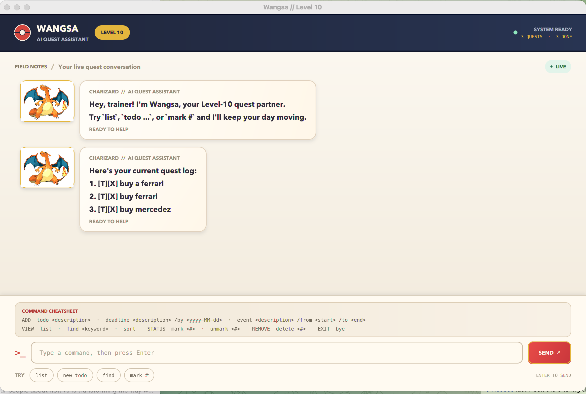

# Wangsa User Guide

Wangsa is a Pokémon-inspired task manager that turns your daily tasks into quests.
Add things to do, track deadlines and events, and mark tasks as complete—all by
typing short commands. Your tasks are saved automatically.

**Contents:** [Quick start](#quick-start) · [Features](#features) ·
[Saving tasks](#saving-tasks) · [Troubleshooting](#troubleshooting) ·
[Command summary](#command-summary)

## Quick start

1. Install **Java 25**. Check your version by running `java -version` in a terminal.
2. Download `Wangsa.jar` from the [latest Wangsa release](https://github.com/Manutd1234/ip/releases/latest)
   and save it as `Wangsa.jar` in a folder you can write to.
3. Open a terminal in that folder and run:

   ```shell
   java -jar Wangsa.jar
   ```

4. The Wangsa window opens. Type a command in the box at the bottom, then press
   **Enter** or click **SEND**.

The same JAR works on **Windows x64, Linux x64, and macOS with Intel or Apple
Silicon**. No separate JavaFX installation or AI account is needed for task commands.



Try these commands one at a time with an empty list:

```text
todo read the project brief
deadline submit report /by 2026-09-20
list
mark 1
```

You now have two tasks, with the first marked complete.

> **Using the source code?** Run `./gradlew run` from the project folder
> (`gradlew.bat run` on Windows). Use `./gradlew runCli` for the terminal interface.
> If the JAR will not open, see [Troubleshooting](#troubleshooting).

## Features

### Before you start

- Replace uppercase placeholders with your own values: `todo DESCRIPTION`
  becomes `todo read a book`. Do not type the placeholders or angle brackets.
- Use lowercase commands and markers. Write `/by`, `/from`, and `/to` as separate
  words, once each, in the order shown. These markers are reserved in deadline
  and event commands.
- Extra spaces around a command are ignored. Spaces or tabs can separate its
  parts; spaces inside descriptions are kept. Required values cannot be empty.
- `NUMBER` is a positive task number shown by `list` or `find`. Both commands
  use the **same numbers**. Deleting or sorting can change them, so use the latest list.
- You can keep **100 tasks**, including completed tasks. Duplicate tasks are allowed.

Task labels use `[T]` for todos, `[D]` for deadlines, and `[E]` for events.
`[ ]` means incomplete; `[X]` means complete.

### Adding a todo: `todo`

Adds a task without a date.

**Format:** `todo DESCRIPTION`

**Example:** `todo read a book`

Adds `[T][ ] read a book` to the end of the list.

### Adding a deadline: `deadline`

Adds a task due on a specific date.

**Format:** `deadline DESCRIPTION /by YYYY-MM-DD`

**Example:** `deadline submit report /by 2026-09-20`

Adds `[D][ ] submit report (by: Sep 20 2026)`.
Use a real date with a four-digit year, two-digit month, and two-digit day.
For example, `2026-02-30` is invalid. Past dates are allowed; times are not supported.

### Adding an event: `event`

Adds an activity with a start and end.

**Format:** `event DESCRIPTION /from START /to END`

**Example:** `event project meeting /from Monday 2pm /to Monday 4pm`

Adds `[E][ ] project meeting (from: Monday 2pm to: Monday 4pm)`.
Start and end are stored as text: Wangsa does not check their order or send reminders.
Both values are required.

### Listing all tasks: `list`

Shows every task, including completed tasks, with its current number.

**Format:** `list`

### Finding tasks: `find`

Finds descriptions containing your search text, ignoring case.

**Format:** `find KEYWORD`

**Example:** `find book` matches `read book`, `BOOK flight`, and `booking tickets`.

Multiple words are treated as one phrase: `find read book` searches for that phrase.
Dates and event times are not searched. If nothing matches, Wangsa says so.

Results keep their full-list numbers. If a result is numbered **4**, use `mark 4`
to complete it, even if it is the only result.

### Sorting by deadline: `sort`

**Format:** `sort`

Places deadlines first, from earliest to latest, followed by todos and events.
Tasks with the same deadline keep their relative order, as do todos and events.
The new order is saved and displayed. Completed tasks follow the same sorting rule.

### Completing a task: `mark`

**Format:** `mark NUMBER`

**Example:** `mark 2` marks task 2 as complete: `[ ]` becomes `[X]`.

The task stays in your list. Marking it again leaves it complete.

### Reopening a task: `unmark`

**Format:** `unmark NUMBER`

**Example:** `unmark 2` marks task 2 as incomplete: `[X]` becomes `[ ]`.

Unmarking an incomplete task leaves it incomplete.

### Deleting a task: `delete`

**Format:** `delete NUMBER`

**Example:** `delete 2` removes task 2. Later tasks move up one number.

> **Deletion is immediate and cannot be undone.** Run `list` first if you are
> unsure which task to remove.

### Exiting Wangsa: `bye`

**Format:** `bye`

Closes Wangsa. Successful changes are already saved, including when you close
using the window's close button.

### Built-in command help: `help`

**Format:** `help`

Shows the command reference immediately. It works without an API key or internet
connection in both the desktop and terminal interfaces.

### Optional AI command help: `@ai`

**Format:** `@ai QUESTION`

Ask a short question about Wangsa's features, for example:

```text
@ai How do I add a deadline for submitting my report?
@ai Is there a command to add priorities to tasks?
@ai How do I reopen a completed task?
```

The AI explains commands and may suggest an example for you to type. It never
executes commands or changes tasks. Answers can be inaccurate; check suggestions
against `help`. Questions must contain 1–1000 characters.

**To enable AI help:**

1. Create a Groq API key in the [Groq console](https://console.groq.com/keys).
2. Set `LLM_API_KEY` in the environment used to launch Wangsa. For a temporary
   macOS/Linux terminal session:

   ```shell
   export LLM_API_KEY='your-groq-api-key'
   java --enable-native-access=ALL-UNNAMED -jar Wangsa.jar
   ```

   In Windows PowerShell:

   ```powershell
   $env:LLM_API_KEY='your-groq-api-key'
   java --enable-native-access=ALL-UNNAMED -jar Wangsa.jar
   ```

   When running from source, use `./gradlew run` or `./gradlew runCli` in that same
   terminal. In IntelliJ, add `LLM_API_KEY` under your run configuration's
   **Environment variables**. Keep your real key out of source code, shared run
   configurations, and Git.
3. Restart Wangsa after changing configuration, then enter an `@ai` question.

The default model is `openai/gpt-oss-20b`, hosted by **Groq**. This requires a Groq
key. Optionally set `LLM_MODEL` to another text chat model available to your Groq
account; consult the [Groq model list](https://console.groq.com/docs/models).
Provider access, usage limits, and charges depend on your account.

Only your question and Wangsa's built-in command reference are sent to Groq.
Saved tasks and previous conversation messages are not sent. Each question is
independent, so include all the context it needs and avoid sensitive information.

Without a key, `@ai` shows setup instructions and clearly labelled **Offline help**.
If the service fails, the same built-in reference remains available. Normal task
commands continue working. Requests use a 20-second timeout and no automatic
retries. In the desktop interface, you can keep using normal commands while one
AI question is pending; wait for its answer before asking another. The terminal
waits for the answer before processing the next command. Closing the desktop
cancels an outstanding request.

### Desktop shortcuts

Click **list** below the command box to show your tasks immediately. **new todo**,
**find**, **mark #**, and **ask AI** fill in a command prefix for you to finish. Press **Up** or
**Down** in the command box to reuse successful commands from this session.

The header shows total and completed task counts. You can resize the window and
scroll to read older messages. The conversation and command history reset when
Wangsa closes.

## Saving tasks

Wangsa saves every successful change in `data/wangsa.db`, inside the folder
**from which you launch the app**. Use the same folder each time and run one
instance at a time. The GUI and CLI share these saved tasks.

**To back up or move your tasks:** close Wangsa and copy the entire `data` folder.
To restore a backup, close Wangsa and replace its `data` folder with your copy.
Moving only the JAR does not move your tasks. Avoid editing the database by hand.

An older `data/wangsa.txt` file is imported once, before the database is first
created. The text file remains; future changes use the database.

If saving fails, Wangsa reports an error and cancels the change. If saved data
cannot be loaded, the GUI shows **STORAGE UNAVAILABLE** and blocks task commands;
`bye` still works. Fix the reported problem or restore a backup, then restart.
The CLI exits after a storage error.

## Troubleshooting

| Problem | What to do |
| --- | --- |
| Unknown command or missing value | Follow the format above. `list`, `sort`, `help`, and `bye` take no extra values. Use each required marker once, in order. |
| Invalid date | Use a real date such as `2026-09-20`. |
| Invalid task number | Run `list` and choose a displayed number. If the list is empty, add a task first. |
| Task list is full | Delete a task before adding another. Completed tasks count towards the 100-task limit. |
| Tasks seem to be missing | Check that you launched Wangsa from the folder containing your usual `data` folder. |
| Cannot load or save tasks | Close other Wangsa instances and check folder access. Keep a backup before repairing data. A malformed legacy text file reports the line to correct. |
| JAR will not open | Use Java 25 and the latest release. Run `java -jar Wangsa.jar` in a terminal to see the error. The release supports Windows/Linux x64 and macOS Intel/Apple Silicon; Linux needs a graphical desktop with GTK 3. |
| AI shows offline help | Set `LLM_API_KEY` to a Groq key in the launch environment, then restart. If already configured, check connectivity, model access, and account usage limits. `help` and normal commands remain available. |

## Command summary

| Action | Format | Example |
| --- | --- | --- |
| Add todo | `todo DESCRIPTION` | `todo read a book` |
| Add deadline | `deadline DESCRIPTION /by YYYY-MM-DD` | `deadline return book /by 2026-09-20` |
| Add event | `event DESCRIPTION /from START /to END` | `event lunch /from 12pm /to 1pm` |
| List tasks | `list` | `list` |
| Find tasks | `find KEYWORD` | `find book` |
| Sort deadlines | `sort` | `sort` |
| Complete task | `mark NUMBER` | `mark 2` |
| Reopen task | `unmark NUMBER` | `unmark 2` |
| Delete task | `delete NUMBER` | `delete 2` |
| Built-in help | `help` | `help` |
| AI command help (optional) | `@ai QUESTION` | `@ai How do I add a deadline?` |
| Exit | `bye` | `bye` |

Guide structure inspired by the
[SE-EDU AddressBook Level 3 User Guide](https://se-education.org/addressbook-level3/UserGuide.html).

See [Credits](https://manutd1234.github.io/ip/CREDITS.html) for character artwork
and other reused material.
